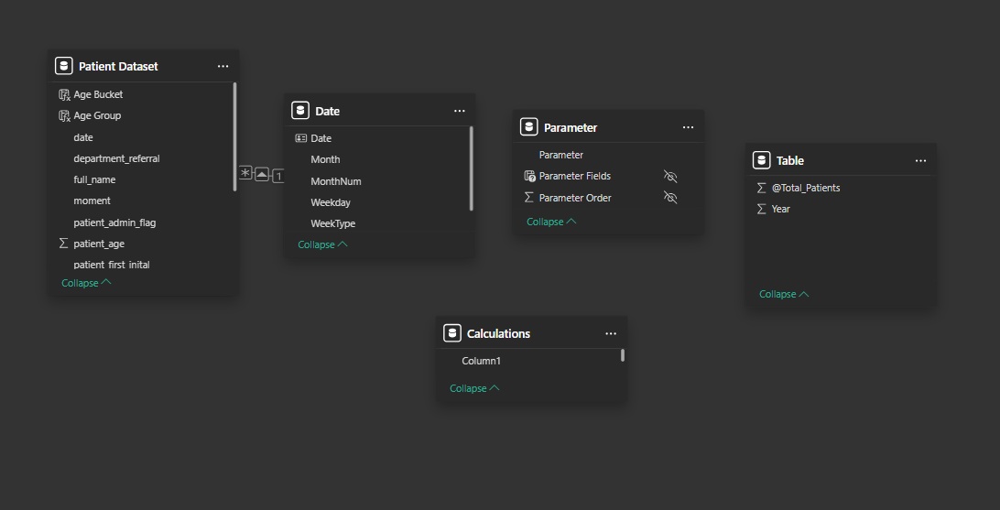
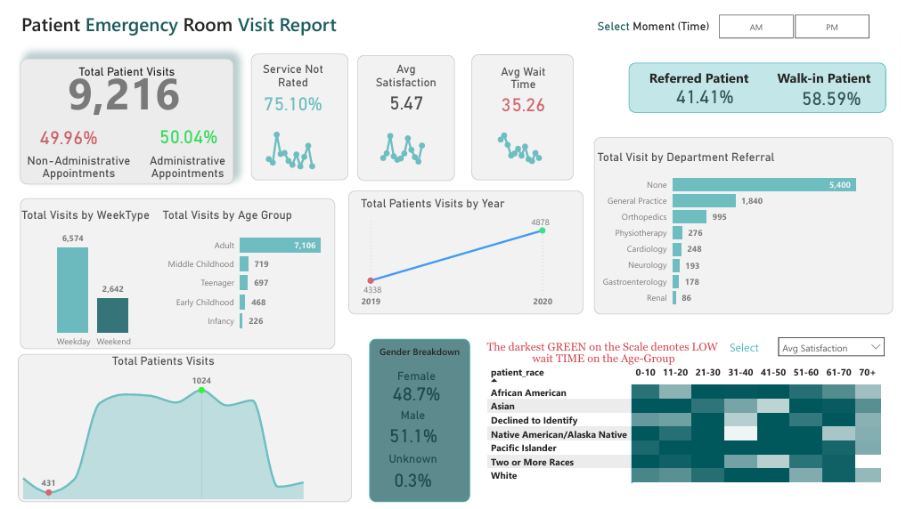

# Patient ER Visits Report — Dashboard Overview
This is a quick analysis of ER patient visits using a dataset of **11 columns and 9,216 rows**.
The dashboard helps understand patient flow, wait times, satisfaction patterns, referrals, and demographics.

## What the dashboard shows

### **1. Average Wait Time**
* Average wait: **35.26 mins**
* Helps see how efficient the ER process is.

Example:

```dax
Average Wait Time = 
CALCULATE(
    AVERAGE('Patient Dataset'[wait_time_mins]),
    'Patient Dataset'[wait_time_mins] <> BLANK()
)
```

### **2. Patient Satisfaction**
* Average score (rated only): **5.47**
* **75.10%** didn’t rate the service (big gap).

### **3. Monthly Visit Trends**
* Shows how patient volume changes month to month.
* Highlights busiest and slowest months.

### **4. Administrative vs Non-Administrative**
* Admin: **50.04%**
* Non-admin: **49.96%**
* Used this to compare wait times & satisfaction differences.

### **5. Referrals vs Walk-Ins**
* Walk-ins: **58.59%**
* Referred: **41.41%**
* Top referral departments:
  * General Practice: **1,840**
  * Orthopedics: **995**

Example:

```dax
% Walk-In =
DIVIDE(
    COUNTROWS(
        FILTER(
            'Patient Dataset',
            'Patient Dataset'[referral_flag] = FALSE()
        )
    ),
    [Total Patients]
)
```

### **6. Demographics**
* **Age Groups:** Adults were most common (7,206 visits).
* **Gender:** 48.7% Female, 51.1% Male, small “Unknown”.
* **Race:** Used for heatmap of wait time & satisfaction.

---

## What I did in Power BI

### **Data Cleanup**
* Didn’t replace any NULL values.
* Added AM/PM column using `Time.Hour()` logic.
* Used column quality view to inspect missing values.

### **Important Measures I Created**
* % Administrative
* Average Satisfaction Score
* % No Rating
* Age Group classification
* Referred vs Walk-in percentages
* Average Wait Time
* Monthly min/max (CF Max Point)

### **Useful Notes**
* Weekend visits: **2,642**
* Weekday visits: **6,574**
* Good amount of insights coming from AM/PM slicer and referral slicer.

---
## Model View (Data Model)

### **Model View Summary**

* One main fact table: **Patient Dataset**
* One Date table connected via `visit_date`
* Relationship type: **One-to-Many** (Date → Patient Dataset)
* Date table marked as the official Date Table
* Used Date table for:

  * Monthly trends
  * Min/max patients per month
  * Weekend/weekday comparison

### **How I structured it**

* Patient Dataset → Connected to → Date table
* No unnecessary relationships (kept the model simple for performance)
* Date table built using CALENDAR()
* Added month, month number, day type, etc. for easy visuals
  
---



---

## Dashboard Visuals Included
* KPI cards
* Monthly visits line chart
* Admin vs Non-admin bar chart
* Heatmap (Race × Wait Time × Satisfaction)
* Age group distribution
* Referral department chart
* AM/PM time filter
## Dashboard Preview



---

## Key Insights

* Most patient visits are routine consultations: showing the clinic deals mainly with predictable, non-emergency cases.
* Morning slots see the highest patient load: which could be optimized by adjusting staffing or scheduling.
* Walk-in patients form a noticeable percentage: indicating the need for a better appointment system or clearer communication to reduce unexpected load.
* Average wait time stays within acceptable limits: but spikes on days with more walk-ins — so controlling walk-ins directly improves wait time.
